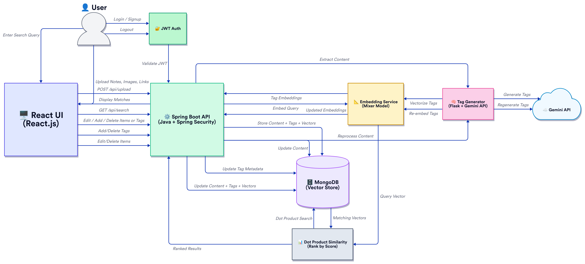

# 📘 Memora

> A full-stack AI-powered content management system that enables users to store, organize, and retrieve notes, images, documents, and links with intelligent, semantic search.

---

## 📌 Overview

**Memora** is more than a file upload or note-taking tool — it’s an intelligent content platform that uses AI to understand and organize your data.

### 🔍 What Makes It Special?

Most systems rely on keyword-based search. Memora uses **semantic tagging and vector embeddings**, enabling it to "understand" content. Even if you search with different words, it can still find relevant results — **like how a human thinks**.

---

## 🧠 Core Features

- 🔐 User registration, login, and password recovery
- ☁️ Upload multiple content types (text, images, files, URLs)
- 🧠 AI-generated semantic tags (Gemini API)
- 📈 1024-dimensional vector embeddings (Mixer model)
- 🔍 Fast semantic search (dot product similarity)
- 🏷️ Manage tags: add, delete, edit
- 🌐 Fully containerized via **Docker**

---

## 🧩 Technology Stack

| Layer       | Technology              | Description                           |
|-------------|--------------------------|---------------------------------------|
| Frontend    | React.js                | UI and user interactions              |
| Backend     | Spring Boot (Java)      | REST API, auth, and business logic    |
| AI Service  | Python + Flask          | Microservice for tagging + embeddings |
| AI APIs     | Gemini API              | Generates contextual tags             |
| Embeddings  | Mixer Model             | Creates vector representations        |
| Database    | MongoDB                 | Stores content, metadata, and vectors |
| DevOps      | Docker + Docker Compose | Unified local deployment              |

---

## 🧠 Architecture

> Color Key:  
> 🟦 Frontend – React  
> 🟩 Backend – Spring Boot  
> 🟧 AI Services – Flask + Gemini + Mixer  
> 🟪 Database – MongoDB  

---

## 🔁 Data Flow & AI Logic

