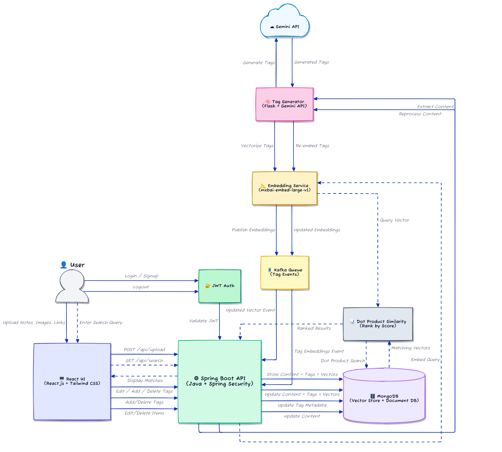
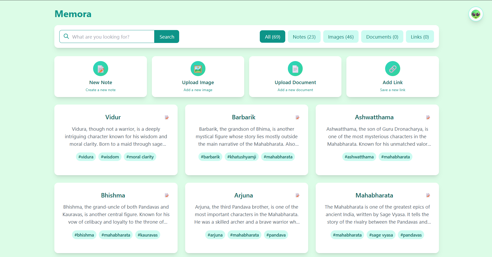
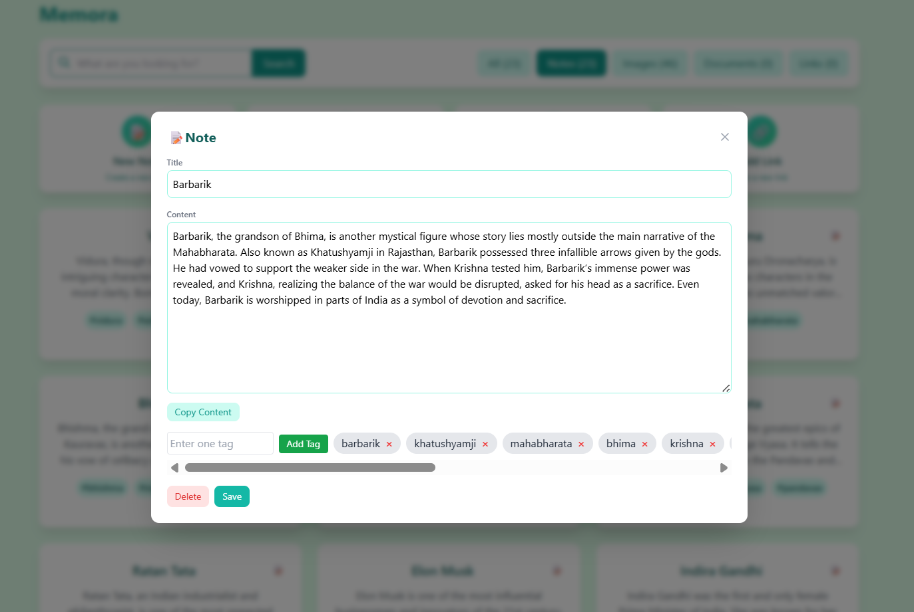
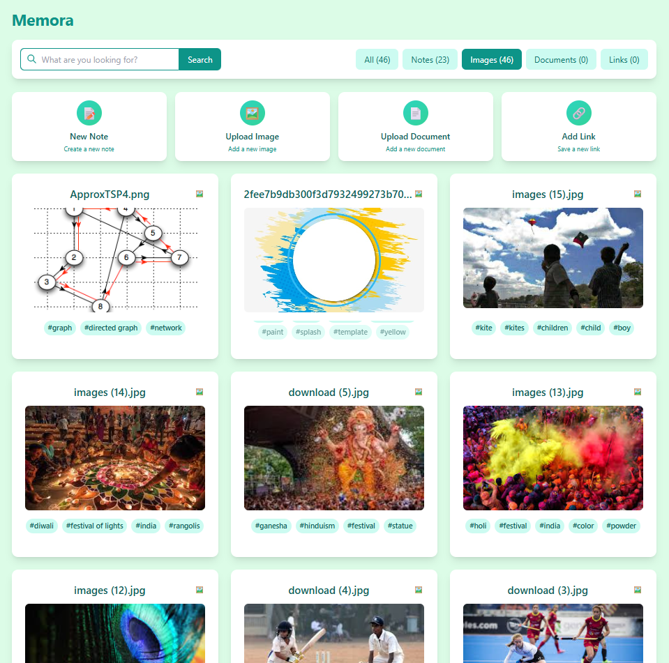

# 📘 Memora

> An AI-powered Semantic Content Hub to help you store, organize, and **search smarter** through notes, documents, images, and links.

---

## 🚀 What is Memora?

**Memora** is a full-stack application that combines artificial intelligence (AI) with content storage to create a **smart personal assistant** for your digital content.

Unlike regular note-taking or file storage apps, Memora can understand the meaning of your files and helps you find them - even if you don’t remember exact words or filenames.

---

## ✨ Key Highlights

- 🔍 **Semantic Search**: Understands *meaning*, not just words.
- 🧠 **AI-Generated Tags**: Uses Google’s **Gemini API** to create smart tags.
- 📂 **Multiformat Uploads**: Upload text, PDFs, images, and web links.
- 📈 **Vector Embedding**: Tags are transformed into AI-readable vectors.
- 🏷️ **Custom Tagging**: You can edit, delete, or add your own tags.
- 🔐 **Secure Access**: JWT authentication for secure login/logout.

---

## 🧠 How Memora Works (Step-by-Step)

Here’s what happens behind the scenes when you upload or search content:

### 1. 📤 Upload Content
- You upload content (text, image, file, or link) from the web interface.
- The frontend sends this data to the backend using a REST API.

### 2. 🧠 Semantic Tagging (AI Service)
- The backend sends the content to an **AI microservice**.
- This microservice uses **Gemini API** to extract the **main ideas** (semantic tags).

### 3. 📐 Vector Embeddings
- The tags are converted into **1024-dimensional vectors** using the **Mixer model** (e.g., `mxbai-embed-large-v1`).
- These vectors allow the system to understand "concepts", not just words.

### 4. 🗄 Store in Database
- Everything is stored in MongoDB:
  - Original content
  - Tags
  - Vectors
  - User information

### 5. 🔍 Semantic Search
- When you type a search query:
  - The query is converted into a vector.
  - Memora finds content whose tag vectors are **mathematically similar** (using dot product similarity).
  - It returns the most relevant results - even with different words.

### 6. ✏️ Edit Tags or Content
- If you update content or tags:
  - The backend sends it to the AI service again.
  - New tags and vectors are created.
  - The database is updated automatically.

### 7. 🔐 User Login & Security
- Supports registration, login, and password recovery.
- Uses **JWT tokens** for secure session management.
- Logout removes the token and ends the session securely.

---

## 🧩 Full Technology Stack

| Layer         | Technology                | Description                           |
|---------------|---------------------------|---------------------------------------|
| Frontend      | React.js, Tailwind CSS    | User interface and interaction        |
| Backend       | Spring Boot (Java 21)     | API, user management, storage logic   |
| AI Service    | Flask (Python)            | Generates tags and vector embeddings  |
| AI API        | Gemini API (Google)       | Used for intelligent tag creation     |
| Embedding     | Mixer / mxbai-embed       | Converts tags to 1024D vector format  |
| Database      | MongoDB (Vector Indexing) | Stores everything with fast search    |

---

## 🧠 Architecture Diagram

> Legend:  
> 🟦 Frontend – React  
> 🟩 Backend – Spring Boot  
> 🟧 AI Services – Flask + Gemini + Mixer  
> 🟪 Database – MongoDB  

## Demo images

---
